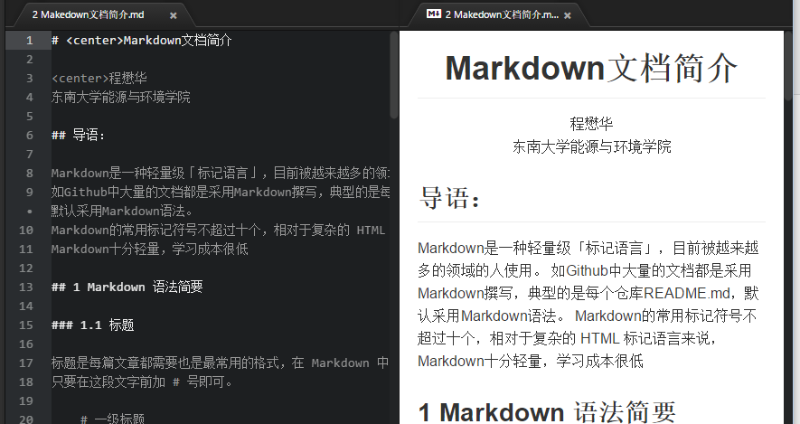

# <center>Markdown文档简介

<center>程懋华   
东南大学能源与环境学院

## 导语

Markdown是一种轻量级「标记语言」，目前被越来越多的领域的人使用。
如Github中大量的文档都是采用Markdown撰写，典型的是每个仓库README.md，默认采用Markdown语法。
Markdown的常用标记符号不超过十个，相对于复杂的 HTML 标记语言来说，
Markdown十分轻量，学习成本很低

## 1 Markdown 语法简要

### 1.1 标题

标题是每篇文章都需要也是最常用的格式，在 Markdown 中，如果一段文字被定义为标题，
只要在这段文字前加 # 号即可。

    # 一级标题

    ## 二级标题

    ### 三级标题

# 一级标题

## 二级标题

### 三级标题

以此类推，总共六级标题，建议在井号后加一个空格，这是最标准的 Markdown 语法

### 1.2 列表

在 Markdown 下，列表的显示只需要在文字前加上 - 或 * 即可变为无序列表，
有序列表则直接在文字前加1. 2. 3. 符号要和文字之间加上一个字符的空格。

#### 无序列表

    * 1A
    * 3C
    * 2B

* 1A
* 3C
* 2B

#### 有序列表

    1. 1A
    2. 3C
    3. 2B

1. 1A
2. 3C
3. 2B

### 1.3 引用

如果你需要引用一小段别处的句子，那么就要用引用的格式。
只需要在文本前加入 > 这种尖括号（大于号）即可

    > 这里是引用


> 这里是引用

### 1.4 图片与链接

插入链接与插入图片的语法很像，区别在一个 !号

    链接为：[]()

    图片为：

#### 插入链接

 [东南大学](http://www.seu.edu.cn)

 [Makedown官网](http://daringfireball.net/projects/markdown/)

#### 插入图片


#### 1.5 粗体与斜体

Markdown 的粗体和斜体也非常简单，用两个 * 包含一段文本就是粗体的语法，用一个 * 包含一段文本就是斜体的语法。

例如：

    **这里是粗体**  

    *这里是斜体*

**这里是粗体**  

*这里是斜体*

#### 1.6 表格

表格是 Markdown 比较麻烦的地方，例子如下：

    | 序号 |课程         | 学分 |
    | ---- |:----------:| ----:|
    | 1    |  工程热力学 | 4 |
    | 2    |  流体力学  | 3 |
    | 3    |  传热学    | 3 |

| 序号 |课程         | 学分 |
| ---- |:----------:| ----:|
| 1    |  工程热力学 | 4 |
| 2    |  流体力学  | 3 |
| 3    |  传热学    | 3 |

### 1.7 代码框

有关程序的文档难免在文章里引用代码，
如果要标记一小段行内代码，用反引号`把它包起来。

例如：学习Python的第一句：`print('hello world')`

如果是一个代码块，用两组3个连续的饭引号``` 把代码
包裹起来形成**“代码框”**：

```
import sys

(last_key, max_val) = (None, -sys.maxint)
for line in sys.stdin:
    (key, val) = line.strip().split("\t")
    if last_key and last_key != key:
        print "%s\t%s" % (last_key, max_val)
        (last_key, max_val) = (key, int(val))
    else:
        (last_key, max_val) = (key, max(max_val, int(val)))

if last_key:
   print "%s\t%s" % (last_key, max_val)  
```

### 1.8 分割线

分割线的语法只需要三个 * 号，例如：

 ****
 >到这里，Markdown 的基本语法就可以满足日常大部分文档要求了，配合适当的工具就可以撰写文档了。
 更多的语法规则，可访问[Makedown官网](http://daringfireball.net/projects/markdown/)。

## 2 使用Atom撰写Makedown文档

Atom是Github开发的一款开源文本编辑器，可定制为多用途的开发环境，如C、Python、PHP，
也是撰写Makedown文档的好工具。编写的同时可预览效果，很方便。本文档就是这样typing出来的。



还有一点很重要，也是我们用Atom撰写makedown文档件，而不采
用其他更流行的Makedown软件的主要原因。

**Atom是基于electron框架开发的，electron可能正在给未来的各种
应用程序UI实现方式带来一个革命！**
